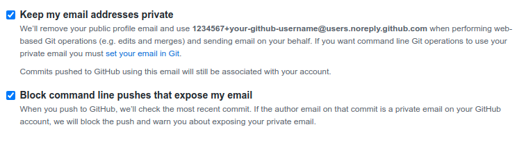

<!-- markdownlint-disable MD013 -->

# Initial setup for the development environment

<!-- _footer: "" -->
<!-- _paginate: false -->

---

## Register

-   [Gmail](https://gmail.com/) - Create a new account Google account. Also create a new Chrome profile for this user. This will be used _only_ for professional development purposes.
-   [Bitwarden](https://bitwarden.com/) - Put all your passwords here. Use the password generator to create strong passwords. Never reuse passwords!
-   [GitHub](https://github.com/) - We will use this to host our source code. This will also be your developer's profile.
-   [Keybase](https://keybase.io/) - We will use this for storing our GPG keys. You can also link your public identities here (optional).

---

## Install (1)

-   [Google Chrome](https://www.google.com/intl/en/chrome/)
    -   [uBlock Origin](https://chrome.google.com/webstore/detail/ublock-origin/cjpalhdlnbpafiamejdnhcphjbkeiagm)
    -   [Privacy Badger](https://chrome.google.com/webstore/detail/privacy-badger/pkehgijcmpdhfbdbbnkijodmdjhbjlgp)
    -   [Octotree](https://chrome.google.com/webstore/detail/octotree-github-code-tree/bkhaagjahfmjljalopjnoealnfndnagc)
    -   [Refined GitHub](https://chrome.google.com/webstore/detail/refined-github/hlepfoohegkhhmjieoechaddaejaokhf)
    -   [Bitwarden - Free Password Manager](https://chrome.google.com/webstore/detail/bitwarden-free-password-m/nngceckbapebfimnlniiiahkandclblb?hl=en)

---

## Install (2)

-   [Visual Studio Code](https://code.visualstudio.com/)
    -   [EditorConfig for VS Code](https://marketplace.visualstudio.com/items?itemName=EditorConfig.EditorConfig)
    -   [Prettier - Code formatter](https://marketplace.visualstudio.com/items?itemName=esbenp.prettier-vscode)
    -   [reStructuredText](https://marketplace.visualstudio.com/items?itemName=lextudio.restructuredtext)
    -   [vscode-pdf](https://marketplace.visualstudio.com/items?itemName=tomoki1207.pdf)
    -   [Extension Pack for Java](https://marketplace.visualstudio.com/items?itemName=vscjava.vscode-java-pack)
    -   [GitLens - Git supercharged](https://marketplace.visualstudio.com/items?itemName=eamodio.gitlens)
    -   [Remote Development](https://marketplace.visualstudio.com/items?itemName=ms-vscode-remote.vscode-remote-extensionpack)
    -   [Marp for VS Code](https://marketplace.visualstudio.com/items?itemName=marp-team.marp-vscode)

---

## Install (3)

If possible, install this in all your devices (desktop/mobile). This will let you authenticate as yourself. You need to have one active device if you want to login using an unknown device.

-   [Keybase App](https://keybase.io/download)

Used for two-factor authentication (2FA). Install everywhere so you won't lose access to your accounts if you lose your phone/laptop.

-   [Authy App](https://authy.com/download/)

---

## Install (4)

> **NOTE**: I would really recommend to just dual-boot a GNU/Linux distribution instead of developing on Windows. However, this should suffice for now.

-   [Windows Subsystem for Linux](https://docs.microsoft.com/en-us/windows/wsl/setup/environment)
-   [Windows Terminal](https://www.microsoft.com/en-us/p/windows-terminal/9n0dx20hk701)

---

## Troubleshooting - Windows Subsystem for Linux

By default, it will install [Ubuntu](https://ubuntu.com/):


If you encounter errors on WSL 2, Open PowerShell with administrative privileges and enter:

```shell
wsl --set-default-version 1
wsl --set-version Ubuntu 1
```

---

## Setup - Windows Terminal

-   Go to [Settings](https://www.tenforums.com/tutorials/177955-how-change-default-profile-windows-terminal-app-windows-10-a.html) and select your new Linux Distro (e.g. Ubuntu).
-   Install the [MesloLGS NF fonts](https://github.com/romkatv/powerlevel10k#manual-font-installation) and update the default font face for Windows Terminal (and Visual Studio Code's Terminal)

---

<!-- _backgroundColor: #333333 -->
<!-- _color: #ffffff -->

**NOTE**: At this point, we will be working on the Windows Terminal, with the Ubuntu distribution's shell open. If you want to understand what you're typing in the shell, you can check the [Unix Shell workshop from Software Carpentry Foundation](https://swcarpentry.github.io/shell-novice/).

**IMPORTANT**: Please don't blindy copy and paste commands. There are some parts where you need to replace certain parts with your own values.

**TIP**: If you get stuck, you can also check [this video from Fireship](https://www.youtube.com/watch?v=-atblwgc63E) on how to setup WSL with common development tools.

---

## Update repositories and upgrade packages

> **NOTE**: It will ask for your password (the one you created during setup) and you won't see what you are typing. This is normal. Just hit `ENTER` when you're done.

```shell
sudo apt update && sudo apt upgrade

# install basic apps
sudo apt install build-essential procps curl file tree git zsh byobu tig neovim zsh direnv
```

---

## Install oh-my-zsh

```shell
# change default shell to zsh
chsh -s $(which zsh)

# install latest version of oh-my-zsh
sh -c "$(curl -fsSL https://raw.github.com/ohmyzsh/ohmyzsh/master/tools/install.sh)"
```

Close and reopen the Windows Terminal.

---

## Install powerlevel10k zsh theme

For more information, you can check [their documentation](https://github.com/romkatv/powerlevel10k#oh-my-zsh):

```shell
git clone --depth=1 https://github.com/romkatv/powerlevel10k.git ${ZSH_CUSTOM:-$HOME/.oh-my-zsh/custom}/themes/powerlevel10k
```

Update the `~/.zshrc` file by opening it with `code`.

```shell
ZSH_THEME="powerlevel10k/powerlevel10k"
```

---

## Install zsh plugins

```shell
# clone zsh-syntax-highlighting
git clone https://github.com/zsh-users/zsh-syntax-highlighting.git ${ZSH_CUSTOM:-~/.oh-my-zsh/custom}/plugins/zsh-syntax-highlighting

# clone zsh-autosuggestions
git clone https://github.com/zsh-users/zsh-autosuggestions.git ${ZSH_CUSTOM:-~/.oh-my-zsh/custom}/plugins/zsh-autosuggestions
```

Update the `~/.zshrc` file by opening it with `code`.

```shell
plugins=(
    # other plugins...
    zsh-syntax-highlighting
    zsh-autosuggestions
    nvm
)
```

---

## Install direnv

Open the `~/.zshrc` using `code` and add this to the bottom:

```shell
eval "$(direnv hook zsh)"
```

---

## Setup - GitHub - Set Email To Private

Go to your [account settings page](https://github.com/settings/emails) and set your email addresses private. Learn more at [the GitHub docs](https://docs.github.com/en/account-and-profile/setting-up-and-managing-your-github-user-account/managing-email-preferences/setting-your-commit-email-address).



Take note of the `noreply` email generated by GitHub. E.g. `1234567+your-github-username@users.noreply.github.com`. We will use this later.

---

## Setup - SSH Key - Generate

Taken from the [GitHub docs](https://docs.github.com/en/authentication/connecting-to-github-with-ssh/generating-a-new-ssh-key-and-adding-it-to-the-ssh-agent):

```shell
# go to the ~/.ssh directory
mkdir -p ~/.ssh && cd ~/.ssh

# generate keypair, substituting in your github email address and username
ssh-keygen -t ed25519 -C "1234567+your-github-username@users.noreply.github.com"
# > Enter a file in which to save the key (/home/you/.ssh/algorithm): [github--your-github-username--wsl]
# > Enter passphrase (empty for no passphrase): [Type a passphrase]
# > Enter same passphrase again: [Type passphrase again]

# start ssh-agent in the background
eval "$(ssh-agent -s)"
# > Agent pid 59566

# add the private key to the ssh-agent
ssh-add ~/.ssh/github--your-github-username--wsl
```

---

## Setup - GitHub - Add SSH Key

Open your **Public** (`.pub`) key using Visual Studio Code:

```shell
# replace with your github username.
# don't forget the .pub at the end!
code ~/.ssh/github--your-github-username--wsl.pub
```

And then copy it to your [GitHub account](https://docs.github.com/en/authentication/connecting-to-github-with-ssh/adding-a-new-ssh-key-to-your-github-account).

---

## Update gpg settings

Add this to `~/.zshrc`:

```shell
GPG_TTY=$(tty)
export GPG_TTY
```

**NOTE**: Without this, the password prompt will not show in WSL!

---

## Setup - Keybase - Install for linux

```shell
# create a Downloads folder (if it's not yet created) and go to the folder
mkdir -p ~/Downloads && cd ~/Downloads

# download the latest keybase installer
curl --remote-name https://prerelease.keybase.io/keybase_amd64.deb

# install using apt
sudo apt install ./keybase_amd64.deb

# run keybase
run_keybase
```

---

## Setup - Keybase - Create GPG Key

```shell
# login
keybase login

keybase pgp gen --multi
# Enter your real name, which will be publicly visible in your new key: Your Name
# Enter a public email address for your key: 1234567+your-github-username@users.noreply.github.com
# Enter another email address (or <enter> when done):
# Push an encrypted copy of your new secret key to the Keybase.io server? [Y/n] Y
# ▶ INFO PGP User ID: Your Name <1234567+your-github-username@users.noreply.github.com> [primary]
# ▶ INFO Generating primary key (4096 bits)
# ▶ INFO Generating encryption subkey (4096 bits)
# ▶ INFO Generated new PGP key:
# ▶ INFO   user: Your Name <1234567+your-github-username@users.noreply.github.com>
# ▶ INFO   4096-bit RSA key, ID DEADBEEF, created 2021-01-01
# ▶ INFO Exported new key to the local GPG keychain
```

---

## Setup - Keybase - Import GPG Key to Linux

```shell
# import public key
keybase pgp export | gpg --import

# import private key
keybase pgp export --secret | gpg --allow-secret-key-import --import
```

---

## Setup - Keybase - Import GPG Key to GitHub

```shell
# check imported key
gpg -k
# ----------------------------------
# pub   4096R/DEADBEEF 2012-08-16
# uid                  Your Name <1234567+your-github-username@users.noreply.github.com>

# if that didn't work, re-import to get the shorted hash
keybase pgp export | gpg --import
```

Take note of the hash (e.g. `DEADBEEF`). Export it:

```shell
keybase pgp export -q DEADBEEF | code -
```

And then add it to your [GitHub Account](https://docs.github.com/en/authentication/managing-commit-signature-verification/adding-a-new-gpg-key-to-your-github-account).

---

## Setup - Git

```shell
# setup global name and email
git config --global user.name "Your Name"
git config --global user.email "1234567+your-github-username@users.noreply.github.com"

# use gpg key when creating commits
git config --global user.signingkey DEADBEEF
git config --global commit.gpgsign true

# use main as the default branch, instead of master
git config --global init.defaultBranch main

# use vscode as the default editor
git config --global core.editor "code --wait"
```

---

## Install Node.js via nvm (Node Version Manager)

Taken from [the nvm docs](https://github.com/nvm-sh/nvm/blob/master/README.md#install--update-script).

```shell
# download the latest installer
curl -o- https://raw.githubusercontent.com/nvm-sh/nvm/v0.39.0/install.sh | bash

# reload the zsh configuration
source ~/.zshrc

# install the version with long term support (LTS)
nvm install --lts
```

Make sure that this can be found in your `~/.zshrc` file by opening it with `code`:

```shell
export NVM_DIR="$([ -z "${XDG_CONFIG_HOME-}" ] && printf %s "${HOME}/.nvm" || printf %s "${XDG_CONFIG_HOME}/nvm")"
[ -s "$NVM_DIR/nvm.sh" ] && \. "$NVM_DIR/nvm.sh" # This loads nvm
```

---

## Install Java using jabba (Java Version Manager)

Taken from [the jabba docs](https://github.com/shyiko/jabba).

```shell
# download the latest version
export JABBA_VERSION=0.11.2
curl -sL https://github.com/shyiko/jabba/raw/master/install.sh | bash && . ~/.jabba/jabba.sh

# reload the zsh configuration
source ~/.zshrc

# install the latest openjdk version (you can run `jabba ls-remote` for all the available versions)
jabba install openjdk@1.17.0
```

Make sure that this can be found in your `~/.zshrc` file by opening it with `code`:

```shell
export JABBA_VERSION=0.11.2
[ -s "$JABBA_HOME/jabba.sh" ] && source "$JABBA_HOME/jabba.sh"
```

---

## Install Python using conda (Python Environment Manager) (1)

Taken from [the conda docs](https://docs.conda.io/projects/conda/en/latest/user-guide/install/linux.html):

```shell
# go to the ~/Downloads directory (create it if not yet created)
mkdir -p ~/Downloads && cd ~/Downloads

# install latest version of miniconda
wget https://repo.anaconda.com/miniconda/Miniconda3-latest-Linux-x86_64.sh

# make it executable
chmod +x ./Miniconda3-latest-Linux-x86_64.sh

# install using zsh
zsh ./Miniconda3-latest-Linux-x86_64.sh
```

---

## Install Python using conda (Python Environment Manager) (2)

```shell
# reload the zsh configuration
source ~/.zshrc

# verify install
conda --version

# check for all python versions available
conda search
```

If `conda search` returns an error, try restarting your computer.

---

## Install Python using conda (Python Environment Manager) (3)

Make sure that this can be found in your `~/.zshrc` file by opening it with `code`.

```shell
# >>> conda initialize >>>
# !! Contents within this block are managed by 'conda init' !!
__conda_setup="$('~/miniconda3/bin/conda' 'shell.zsh' 'hook' 2> /dev/null)"
if [ $? -eq 0 ]; then
    eval "$__conda_setup"
else
    if [ -f "~/miniconda3/etc/profile.d/conda.sh" ]; then
        . "~/miniconda3/etc/profile.d/conda.sh"
    else
        export PATH="~/miniconda3/bin:$PATH"
    fi
fi
unset __conda_setup
# <<< conda initialize <<<
```

<!-- markdownlint-enable MD013 -->
